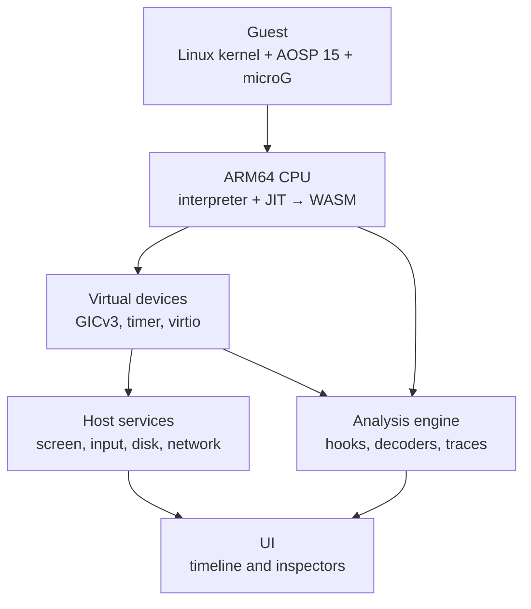

# Vetro

**A complete arm64 Android system, emulated inside a browser tab — with an
analysis layer that sees everything apps do, from the outside.**

No installation, no root, no server. Vetro runs an unmodified Android Open
Source Project build (with microG instead of Google services) on an ARM64 CPU
emulator written in Rust and compiled to WebAssembly. Because all
observation happens in the emulator, apps have nothing injected into them to
detect.

> Vetro is an independent project. It is not affiliated with or endorsed by
> Google. Android is a trademark of Google LLC.

## Guiding principle

**Fidelity before speed.** An app must execute exactly its own code, even at
10 fps. Optimisation only comes after behaviour is correct and verified
against a reference (QEMU).

## Goals for 1.0

- Open a URL in desktop Chrome or Edge and reach the Android home screen in
  under 15 seconds, starting from a cached snapshot.
- Drag an APK onto the page: it installs and is usable with mouse and
  keyboard (simulated touch).
- A reference set of 30 apps (20 from F-Droid, 10 popular apps that do not
  require Play Integrity) completes the basic flows: launch, login,
  navigation.
- Every network request is visible in clear text, attributed to process and
  library, and linked on a timeline to the user action that caused it.
- Every access to sensitive data (location, contacts, clipboard,
  identifiers, accounts) is recorded by decoding Binder transactions.
- Sessions export to HAR, pcap and JSON.

**Out of scope for 1.0:** Play Store, original Google Play Services and Play
Integrity; heavy 3D games at playable frame rates; iPhone and mobile Safari;
any mandatory cloud component. The only optional external piece is a network
relay for users who want real server responses.

## How it works



- **CPU:** AArch64 only (EL0/EL1), a reference interpreter plus a block JIT
  that emits WebAssembly modules; one Web Worker per virtual core.
- **Platform:** a replica of QEMU's `virt` board (GICv3, generic timer,
  PL011, PL031, virtio-mmio) with a generated device tree.
- **Guest:** GKI kernel and AOSP 15 (API 35) arm64, built from source as
  `userdebug` with full symbols; software rendering (SwiftShader).
- **Host:** virtio-gpu 2D to a WebGPU canvas, virtio-input from pointer
  events, virtio-blk over HTTP Range with an OPFS cache, virtio-net into a
  WASM TCP/IP stack (sinkhole or optional WebSocket relay), adb over a virtio
  channel.
- **Analysis:** guest-address hooks inserted by the JIT (invisible to apps);
  decoders for syscalls, Binder, TLS (BoringSSL/Conscrypt) and ART.

First target browsers are desktop Chrome and Edge (SharedArrayBuffer with
COOP/COEP, WebGPU), then Firefox.

## Roadmap and status

Each milestone has an exit criterion checked by a command; a milestone is
done only when that command passes in CI.

| | Milestone | Exit criterion | Status |
|---|---|---|---|
| M0 | Scaffolding and oracle | `cargo test` green; a test runs QEMU and reads its output in CI | ✅ done |
| M1 | AArch64 CPU interpreter | per-instruction suite; ≥200 random programs match `qemu-aarch64` | ✅ done |
| M2 | Linux user-mode syscalls | LTP subset, static BusyBox runs | ✅ done |
| M3 | System mode, kernel boot | kernel + initramfs reaches a shell; kselftest subset | ✅ done |
| M4 | JIT to WebAssembly | M1/M2 tests pass with JIT; interpreter/JIT parity | 🚧 next |
| M5 | Android boots | home screen in Chrome; `adb install` of an APK works | — |
| M6 | Snapshots and install | home in < 15 s from snapshot; drag-and-drop APK | — |
| M7 | Network analysis and timeline | HTTPS in clear text, linked to user actions; HAR export | — |
| M8 | Binder and privacy | every sensitive access reported; decoy data tracked to the network | — |
| M9 | Code tracing and scripting | ART method hooks, dynamic dex capture, Frida-like API | — |
| M10 | Record & replay, 1.0 | deterministic replay; all 30 reference apps; 1.0 goals met | — |

**Where we are.** Vetro runs unmodified Linux arm64 programs in user mode.
It has the complete ARMv8.0 integer, SIMD/FP and crypto instruction set of a
Cortex-A53, and an emulated Linux kernel with processes, threads, signals,
virtual time and `/proc`. These all match `qemu-aarch64` in CI:
- 355 LTP syscall tests;
- the main BusyBox applets;
- the RISU instruction tests.

Tests where QEMU itself deviates from Linux are checked against the real
kernel on an arm64 host (ADR 0010).

It also runs as a complete machine (`vetro-machine`): a CPU at EL0/EL1,
stage-1 MMU, GICv3, generic timer, PL011, PL031 and virtio-mmio. It boots
Linux 6.18 to an interactive shell, with a boot log identical to
`qemu-system-aarch64`. Its 95 in-guest kernel selftests have the same
outcomes as under QEMU. Everything is deterministic: guest time is the
instruction count, so a boot is exactly 98,439,742 instructions, about 2 s on
an M2.

Next is M4, a JIT to WebAssembly.

Detailed plan and progress log (Italian): [`docs/PLAN.md`](docs/PLAN.md),
[`docs/progress/`](docs/progress/), architecture decisions in
[`docs/adr/`](docs/adr/).

## Building and testing

Requires `rustup` (the pinned nightly toolchain is installed automatically
from `rust-toolchain.toml`).

```sh
tools/ci.sh    # fmt, clippy, native tests, wasm32 build — same as CI
```

The differential tests compare Vetro against `qemu-aarch64` (QEMU user mode,
Linux only):

- **Linux:** `sudo apt-get install qemu-user`
- **macOS:** start Docker, then
  `export VETRO_QEMU_AARCH64="$PWD/tools/oracle/qemu-aarch64-docker.sh"`

Without an oracle those tests print `SKIP`; set `VETRO_REQUIRE_ORACLE=1` to
make a missing oracle a failure (always on in CI).

## Repository layout

```
crates/   vetro-cpu, vetro-mmu, vetro-jit, vetro-platform, vetro-net,
          vetro-analysis, vetro-snapshot, vetro-wasm, vetro-cli
web/      browser app (workers, host services, UI)
guest/    kernel config, AOSP device target, image packaging
relay/    optional WebSocket network relay
tests/    per-instruction, differential (vs QEMU), boot, apps, e2e
tools/    CI script, QEMU oracle wrapper, benchmarks
docs/     plan, ADRs, component specs, progress log
```

## License

Vetro is **source-available**, not open source: it is licensed under the
[PolyForm Noncommercial License 1.0.0](LICENSE.md). You may use, modify and
share it for noncommercial purposes; **commercial use is not permitted**
without a separate written agreement. See [`NOTICE`](NOTICE).

Third-party components keep their own licenses — notably the Linux kernel
(GPL-2.0), whose exact sources are published with every distributed guest
image.
