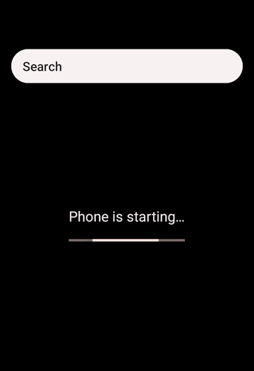

# Device profiles

A device profile describes the phone Vetro builds: its screen size and
density, its memory, and a few details the system shows to apps, such as
the serial number and the device name. Choose one in the **Device profile**
menu of the setup form, before **Start**.

## The profiles that come with Vetro

| Profile | Screen | Density | Memory | Notes |
|---|---|---|---|---|
| **Light (landscape)** | 960 x 600 | 180 dpi | 2 GiB | selected by default: the same layout as full resolution with about half the pixels to draw, so the phone answers sooner; ready-made snapshot |
| **Full resolution (landscape)** | 1280 x 800 | 240 dpi | 2 GiB | sharper, slower to draw; ready-made snapshot |
| **Phone** | 720 x 1280, portrait | 320 dpi | 2 GiB | a typical 5-inch phone (360 x 640 dp) |
| **Small phone** | 480 x 800, portrait | 240 dpi | 1.5 GiB | a small, low-memory phone (320 x 533 dp) |
| **Tablet** | 1280 x 800, landscape | 213 dpi | 2 GiB | wide enough (600 dp) for apps to use their tablet layouts |

With a profile other than the two landscape ones, the **first start is a
cold boot** of about 45 minutes, because ready-made snapshots are published
only for those. From then on that profile resumes in seconds like any
other: each profile keeps its own saved phone (see
[Snapshots and saved data](snapshots-and-data.md)).



## What a profile changes

- **Screen size**: the virtual display offers this size, and the system
  draws at it.
- **Density**: how many pixels make one "dp", so how large text and buttons
  are. It is also what apps use to pick phone or tablet layouts.
- **Memory**: the phone's RAM. You can still change **RAM** in the form.
- **Serial number and SKU**: what `Build.getSerial()` and `Build.SKU` return
  to apps.
- **Time zone** and **device name**: applied through adb once the system has
  booted, and kept by the phone. The device name is the one in
  **Settings > About**.
- **Language (locale)**: stored in the same way, but the system reads it
  only when it starts, so a new language takes effect from the next full
  start of the system, not immediately.

Some things cannot change without a new system image, among them the model,
brand and manufacturer names apps read from `Build.MODEL` and friends (they
say "Vetro"), and the language at the very first start.

## Your own profile

A profile is a small JSON file. Write one, then click **load a profile
file** in the setup form and pick it; it is added to the menu. You can also
open the app with `profile=phone` (or `small-phone`, `tablet`) in the
address to choose a built-in profile.

```json
{
  "vetroProfile": 1,
  "id": "my-phone",
  "name": "My phone",
  "description": "A 6-inch phone in portrait.",
  "screen": { "width": 1080, "height": 2340, "density": 420 },
  "ramMiB": 3072,
  "locale": "it-IT",
  "timezone": "Europe/Rome",
  "device": { "name": "Test phone", "serial": "TEST0001", "sku": "test" }
}
```

| Field | Required | What it is |
|---|---|---|
| `vetroProfile` | yes | the format version: `1` |
| `id` | yes | a short name: lowercase letters, digits and dashes |
| `name` | yes | the name shown in the menu |
| `description` | no | one line shown under the menu |
| `screen.width`, `screen.height` | yes | pixels, even numbers from 320 to 3840 |
| `screen.density` | yes | dpi, from 120 to 640 |
| `ramMiB` | yes | memory in MiB, from 1024 to 3072, a multiple of 64 |
| `locale` | no | a language tag such as `en-US` or `it-IT` (default `en-US`) |
| `timezone` | no | a time zone such as `Europe/Rome` or `UTC` |
| `device.name` | no | the device name in Settings |
| `device.serial` | no | the serial number: letters and digits, up to 20 |
| `device.sku` | no | the SKU: letters, digits, dots, dashes, underscores |

Vetro checks the file strictly: an unknown field, a value out of range or a
newer format version is an error, shown in the status line, so a typo never
changes the phone silently.

Large screens cost memory and speed: every frame has more pixels to draw on
an emulated processor. The built-in profiles are a good balance.

## From the command line

The native runner accepts the same profiles:

```sh
vetro boot --boot-img boot.img --vendor-boot vendor_boot.img --init-boot init_boot.img \
  --disk disk.img --profile phone        # or --profile my-profile.json
```

It prints the adb commands for the settings applied after the boot (time
zone, device name, language). The file format is described for developers
in `docs/specs/device-profiles.md` in the repository.
