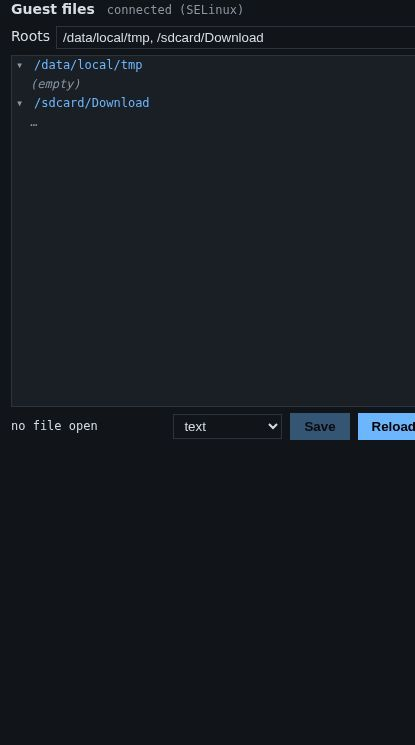

# File manager

The **Guest files** panel, under **Tools** below the phone screen, shows files inside the
running phone. You can open them, read them in a suitable viewer, and edit
them while apps are running.



## How it works, in one paragraph

A small Vetro service inside the phone (`vetro-files`) does the reading and
writing, through the phone's own kernel, and talks to the page over a
private virtual channel (virtio-vsock). Nothing touches the disk image
behind the system's back, so the file system stays consistent, and a file
you save keeps its owner, its permissions and its SELinux label. Every
change you make is also recorded, so a [replay](record-and-replay.md) stays
identical.

The panel says **connected** when the service answers; it starts shortly
after the system has booted.

## Choosing the folders

**Roots** lists the folders shown in the tree, separated by commas. For the
phone the default is `/data/local/tmp, /sdcard/Download`. Some useful
places:

| Folder | What is there |
|---|---|
| `/data/data/<package>` | an app's private files: databases, preferences, caches |
| `/sdcard/Android/data/<package>` | an app's files on shared storage |
| `/sdcard/Download` | downloads and files you put there |
| `/data/local/tmp` | a scratch folder for your own tests |

Type the folders and press Enter. Following the app in the foreground
automatically is planned.

Private app folders (`/data/data/...`) belong to each app's own user: the
service runs with the rights of this development build, so it can read and
write them.

## Browsing

Click a folder to open it; click again to close it. Open folders are
**watched**: when an app creates, changes, renames or deletes a file there,
the tree updates by itself within a moment. Hover over an entry to see its
permissions, owner, size, link target and SELinux context.

## Viewing

Click a file to open it. Vetro picks a viewer from its content, and you can
change it with the menu:

- **text**, **JSON** and **XML**;
- **SharedPreferences**: Android's preference files (XML with a `<map>`
  root) are shown as a table of names, types and values;
- **SQLite**: tables and rows of a database (the first 500 rows of a
  table), including changes still in its write-ahead log (`-wal`);
- **image**: PNG, JPEG, GIF, WebP, BMP;
- **hexadecimal**: any file (the first 256 KiB).

If the file changes inside the phone while it is open, the viewer reloads
it by itself (or warns you, if you have unsaved changes). **Reload** reads
it again at any time.

## Editing

- **Text, JSON, XML, hexadecimal:** edit in place, then click **Save**. JSON
  and XML are checked before writing. The file is replaced in one step
  (an atomic write), so an app never reads a half-written file.
- **SharedPreferences:** change names, types and values in the table, add
  or remove entries, then **Save**. Values are checked the way Android reads
  them back, and the file is written in the same form Android writes it.
- **SQLite:** click a cell to change it, **Insert row** to add one, **✕** to
  delete one, or **SQL…** for your own statement. Each time the panel shows
  the query first; **Run in guest** runs it inside the phone with the
  phone's own SQLite, then the table is read again.

Apps usually read their preferences and databases when they start: after an
edit, close and reopen the app (for example `am force-stop <package>` on the
adb line, then open it again) to see the effect.

## Creating, deleting and moving files

The panel edits files that exist; creating, deleting, renaming, uploading
and downloading files from the panel are not available yet. For simple
cases, use the adb line, then open the file in the panel:

```sh
echo '{}' > /data/local/tmp/test.json    # create a file
rm /data/local/tmp/test.json             # delete it
cp /sdcard/Download/a.db /data/local/tmp/ # copy one
```

To copy text out of the phone, open the file in a viewer and copy it from
there.
