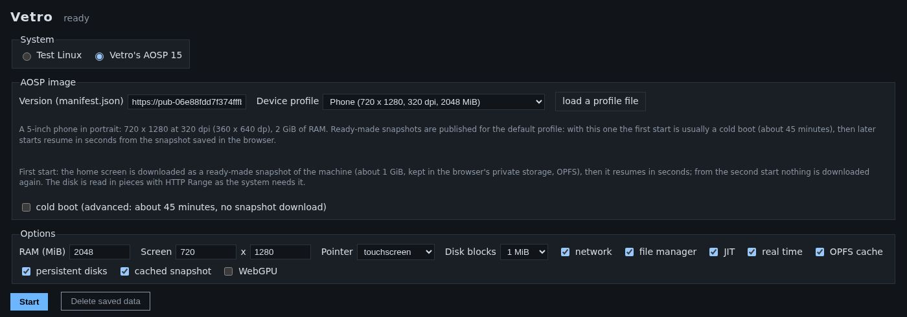

# Getting started

## What you need

- **A desktop browser based on Chromium**: Google Chrome or Microsoft Edge,
  a recent version. Other browsers are not supported yet (see
  [Troubleshooting](troubleshooting.md#browser-support)).
- **A computer with at least 8 GB of memory.** The phone gets 2 GiB of its
  own, and the tab needs close to 3 GiB in total while it runs.
- **About 1 GB of free disk space** for the saved phone, plus room for the
  apps you install.
- **A good connection for the first visit**: it downloads about 0.5 GB once.

Phones and tablets cannot run Vetro yet: it needs a desktop browser.

## Open the site

1. Go to [1vcian.github.io/Vetro](https://1vcian.github.io/Vetro/) and click
   **Open the app** (or **Launch the demo** for the small Linux test
   system).
2. Under **System**, choose **Vetro's AOSP 15**.
3. Leave the **Device profile** on **Default (landscape)** for the fastest
   start (other profiles are explained in
   [Device profiles](device-profiles.md)).
4. Click **Start**.

A shortcut that does all of this in one step:
`https://1vcian.github.io/Vetro/app/?os=android&autostart=1`.

## The first visit

Booting the phone system from nothing takes tens of minutes on an emulated
processor, so Vetro does not make you wait for it. Instead, the first start
downloads a **ready-made snapshot**: the whole machine saved at the home
screen, about 0.5 GB.

- A progress bar shows how much is left, the speed and an estimate of the
  time. On a fast connection the download takes well under a minute; at
  6 MB/s it takes a couple of minutes.
- Every piece is checked (SHA-256) before it is written, so a damaged
  download is never used.
- If the download stops (a closed tab, a lost connection), reload the page:
  it resumes where it stopped.
- When the download is done the machine is restored and the home screen
  appears. In our tests the phone was ready about 25 seconds after the page
  opened, with a fast connection.

The phone's disk is not downloaded as a whole: Vetro reads the pieces the
system needs, when it needs them, and keeps them. The first time you open
an app you may notice a short wait while its files arrive.

## Later visits

From the second visit on, nothing large is downloaded again. The machine
resumes from the snapshot saved in your browser, usually in a few seconds,
and you find the phone as you left it at the last save: installed apps,
settings and files included.

Vetro saves the machine by itself at the home screen and after you install
an app, and you can save at any moment with **Save state** under the screen.
See [Snapshots and saved data](snapshots-and-data.md).

## The screen, the panels and the console

Once the machine runs, the page has:

- **the phone screen** on the left, with the **Power button** and
  **Save state** buttons below it;
- **the phone panel**: the download and boot progress, the adb connection,
  the place to drop an APK, and an adb command line
  ([Using the phone](using-the-phone.md));
- **Guest files**: the [file manager](file-manager.md);
- **the console**: the system's log, as a serial cable would show it;
- **the analysis tabs** at the bottom: **Network**, **Timeline** and
  **Recording** ([Network inspector and timeline](network-and-timeline.md),
  [Record and replay](record-and-replay.md)).

## Starting from scratch instead (advanced)

Tick **cold boot** in the setup form to boot the system from nothing instead
of downloading the snapshot. It downloads only the boot images (about
136 MiB) and the disk pieces the system reads, but the boot takes about 45
minutes before the home screen. The boot panel shows each phase as it
happens (kernel, init, zygote, graphics, system_server, boot finished,
home screen). When the home screen is up, Vetro saves the machine, and later
visits resume from there as usual.
