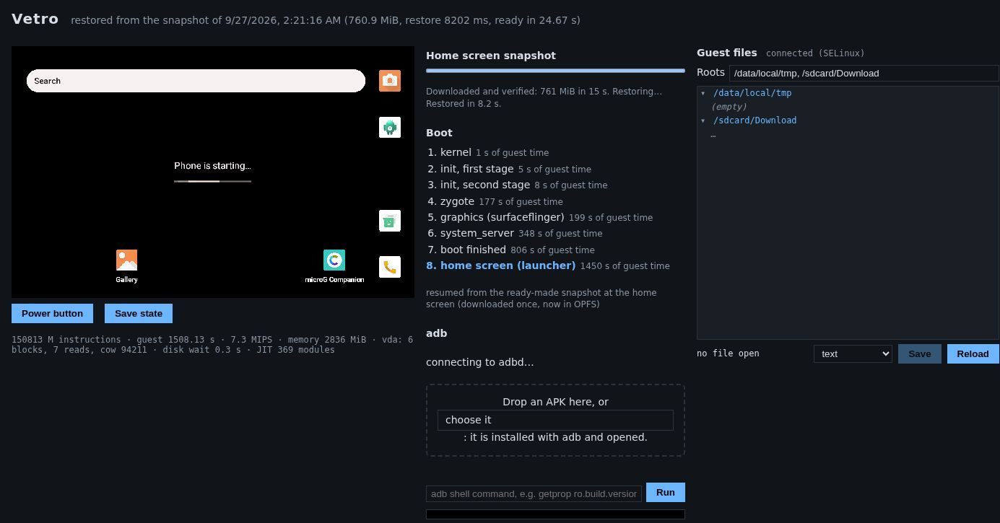

# Getting started

## What you need

- **A desktop browser based on Chromium**: Google Chrome or Microsoft Edge,
  a recent version. Other browsers are not supported yet (see
  [Troubleshooting](troubleshooting.md#browser-support)).
- **A computer with at least 8 GB of memory.** The phone gets 2 GiB of its
  own, and the tab needs close to 3 GiB in total while it runs.
- **About 1 GB of free disk space** for the saved phone, plus room for the
  apps you install.
- **A good connection for the first visit**: it downloads about 0.5 GB once.

Phones and tablets cannot run Vetro yet: it needs a desktop browser.

If the browser cannot run Vetro (it lacks WebAssembly SIMD, for example), or
may not run it well (another browser, a phone, too little memory), the page
says so in a box above the screen instead of failing silently.

## Open the site

Go to [1vcian.github.io/Vetro](https://1vcian.github.io/Vetro/) and click
**Launch Vetro**. That is all: there is nothing to choose. The phone starts
by itself, with the settings that suit most people (the current system
image, the light landscape screen, one processor core).

The app's own address, [1vcian.github.io/Vetro/app/](https://1vcian.github.io/Vetro/app/),
does the same: bookmark it to go straight to the phone.

## The first visit

Booting the phone system from nothing takes tens of minutes on an emulated
processor, so Vetro does not make you wait for it. Instead, the first start
downloads a **ready-made snapshot**: the whole machine saved at the home
screen, about 0.5 GB.

- One line at the top of the page says what is happening: how much of the
  download is done (for example "Downloading the phone: 120 MiB of 512 MiB,
  about 30 s left"), then "Starting the phone…", then **Ready**.
- Every piece is checked (SHA-256) before it is written, so a damaged
  download is never used.
- If the download stops (a closed tab, a lost connection), reload the page:
  it resumes where it stopped.
- When the download is done the machine is restored and the home screen
  appears. In our tests the phone was ready about 25 seconds after the page
  opened, with a fast connection.

The phone's disk is not downloaded as a whole: Vetro reads the pieces the
system needs, when it needs them, and keeps them. The first time you open
an app you may notice a short wait while its files arrive.

## Later visits

From the second visit on, nothing large is downloaded again. The machine
resumes from the snapshot saved in your browser, usually in a few seconds,
and you find the phone as you left it at the last save: installed apps,
settings and files included.

Vetro saves the machine by itself at the home screen and after you install
an app. See [Snapshots and saved data](snapshots-and-data.md).

## The page

The page shows only what you need to use the phone:

- **the phone screen**, with the **Power** button below it
  ([Using the phone](using-the-phone.md));
- **the Apps panel** next to it: suggested apps to install with one click,
  and the box where you can drop an APK file (you can also drop it on the
  screen);
- **the progress line** at the top.

Everything else is under **Tools**, a small toggle below the screen, closed
until you open it:

- **Save state** and **Delete saved data**
  ([Snapshots and saved data](snapshots-and-data.md));
- the boot phases, the adb connection and an adb command line
  ([Using the phone](using-the-phone.md#the-adb-line));
- **the console**: the system's log, as a serial cable would show it;
- **Guest files**: the [file manager](file-manager.md);
- **the analysis tabs**: **Network**, **Timeline** and **Recording**
  ([Network inspector and timeline](network-and-timeline.md),
  [Record and replay](record-and-replay.md)).

## The Linux demo

The landing page also links a small **Linux demo**
([app/?os=linux](https://1vcian.github.io/Vetro/app/?os=linux)): a Linux 6.18
system with a BusyBox shell, ready in a few seconds. Its shell is the
console next to the screen: click it and type commands.

## For developers: every option

Adding `?advanced=1` to the app's address shows the full setup form, with
every option the defaults hide: the system (AOSP or the Linux demo), the
image version or any `manifest.json`, the [device profile](device-profiles.md),
**cold boot** instead of the ready-made snapshot, full animations and blurs,
RAM, screen size, cores, JIT, network, storage options and, for Linux, the
kernel, initramfs, disk and command line. Tools are open in this mode, and
nothing starts until you click **Start**.

The same options work as address parameters on the normal page, which then
starts by itself with them, for example `?profile=phone`, `?cold=1`,
`?cpus=2`, `?gpu=webgl` or `?graphics=full`.

A **cold boot** boots the system from nothing instead of downloading the
snapshot. It downloads only the boot images (about 136 MiB) and the disk
pieces the system reads, but it takes about 45 minutes before the home
screen. The boot phases under Tools show each one as it happens (kernel,
init, zygote, graphics, system_server, boot finished, home screen). When the
home screen is up, Vetro saves the machine, and later visits resume from
there as usual.
