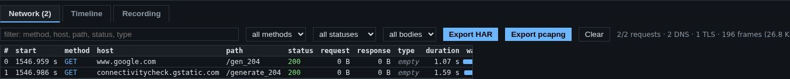
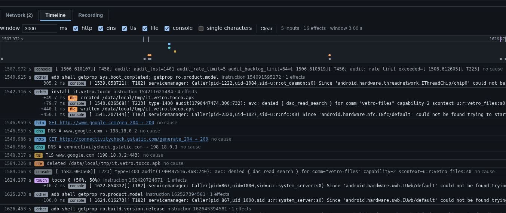

# Network inspector and timeline

Everything the phone sends and receives passes through Vetro's own network
card, so Vetro sees it without installing anything in the phone and without
the apps being able to notice. The **Network** and **Timeline** tabs show
it: open **Tools**, the small toggle below the phone screen, to see them.

## What the phone's network is

The phone believes it is on a normal network (address `10.0.2.15`, with a
gateway and a DNS server), but today that network is a **sinkhole**: it does
not reach the internet.

- Name lookups (DNS) get made-up addresses, so the phone can connect to
  them.
- Plain HTTP connections to port 80 get an empty "200 OK" answer.
- Other connections are accepted and recorded, but nothing answers them
  like the real server would; HTTPS connections do not get past the start
  of the encrypted handshake.

This keeps the phone completely isolated: whatever an app sends stays in
your browser. The flip side is that most apps that need their server will
show an offline or error message. An optional relay, for people who want
real server answers, is planned.

## The Network tab

Right after start-up you will typically see two small HTTP requests: the
system checking whether it is online (its connectivity check), answered by
the sinkhole.

Each row is one request: when it started, the method, the host and path,
the response status, the sizes of the request and the response, the body
type, the duration, and a waterfall bar that shows it in time.

- **Filter** by text (method, host, path, status or type), or with the
  menus: method, status class (2xx, 3xx, 4xx, 5xx, no response) and body
  type (JSON, form, multipart, protobuf, text, binary).
- **Click a row** to see its details: the timing of each phase, the
  headers, and the bodies decoded when Vetro recognises them (JSON, forms,
  multipart, protobuf without a schema, text), or as hexadecimal.
- **Export HAR** downloads the requests as a HAR 1.2 file, which browsers'
  developer tools and many other tools can open.
- **Export pcapng** downloads every network frame the phone exchanged, for
  Wireshark.
- **Clear** empties the list.

The line on the right counts requests, DNS questions, TLS connections and
frames.

Vetro also has hooks that read HTTPS traffic in clear text inside the TLS
libraries, from the outside. They work in the command-line tools; bringing
them to the page, together with a TLS endpoint for the sinkhole, is still in
progress.

## The Timeline tab

The timeline ties **what you did** to **what happened next**.

- **Inputs** are your actions: taps, keys, the power button, adb commands,
  installing an APK, lines typed in the console, saving a file from the file
  manager.
- **Effects** are what the phone did: HTTP requests, DNS questions, TLS
  connections, files created or changed (in the folders open in the file
  manager), console output.

Time on the timeline is the phone's own clock (guest time), which advances
with the instructions the phone executes, so it is the same on a fast and a
slow computer.

Each effect is attributed to the last input that came before it within the
**window** (3 seconds by default; you can change it). This is a simple
rule, not a proof: a request an app makes by itself, on a timer, may land
on whatever you did just before it.

- The checkboxes show or hide each kind of effect; **single characters**
  also shows each key you typed (hidden by default, since single keys rarely
  cause network traffic).
- Click a request on the timeline to open it in the Network tab.
- **go here** appears on inputs covered by a recording: it replays the
  recording up to that moment (see [Record and replay](record-and-replay.md)).
- **Clear** empties the timeline.
