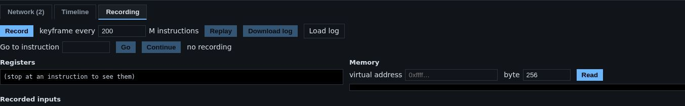

# Record and replay

Vetro's machine is **deterministic**: given the same starting state and the
same inputs at the same moments, it does exactly the same thing, down to
the last instruction. Its clock is the count of executed instructions, and
every input (taps, keys, adb commands, network data from outside, file
manager edits) goes through one recorded point.

So a session can be recorded as a starting point plus a list of inputs, and
replayed later to get the identical run. You can also stop a replay at any
instruction and look at the processor's registers and memory at that
moment.

The **Recording** tab, under **Tools** below the phone screen, does all of
this.

## Recording

1. Open **Tools**, then the **Recording** tab, and click **Record**.
2. Use the phone as usual.
3. Click **Stop** (the same button).

While recording, Vetro also saves **keyframes**: complete snapshots of the
machine every so often (every 200 million instructions by default; change it
in **keyframe every … M instructions** before you start). Keyframes are what
make jumping around fast: a jump starts from the nearest keyframe instead of
from the beginning. They are kept in your browser's private storage.

Keyframes are full copies of the machine, so they are big: with the phone,
a single one can take hundreds of MB. For long sessions, record fewer of
them (a larger interval); jumps will just take a little longer.

The list **Recorded inputs** shows what was recorded, with the instruction
number of each input.

## Replaying

Click **Replay**. The machine goes back to the first keyframe and replays
every recorded input at the exact instruction where it happened. At the end
Vetro compares the state with the recording and tells you either **replay
identical**, or where the replay first differed.

During a replay:

- your own taps and keys are ignored (the recording drives the machine);
- the file manager is closed;
- the machine runs as fast as it can, not in real time, and no snapshot is
  saved.

When the replay ends, the machine runs freely again from there.

## Jumping to an instruction

Type a number in **Go to instruction** and click **Go**. Vetro replays from
the nearest keyframe up to that instruction and stops there. Then:

- **Registers** shows the processor's registers at that moment;
- **Memory**: type a virtual address (for example `0xffff800080000000`) and
  a length, and click **Read** for a hexadecimal dump of the memory at that
  address, as the processor sees it at that moment;
- **Continue** replays the rest of the recording to the end.

The **go here** buttons in the recorded inputs list and on the
[timeline](network-and-timeline.md#the-timeline-tab) do the same for the
moment of an input.

## Saving and loading a recording

- **Download log** saves the recording, keyframes included, as a `.vrec`
  file.
- **Load log** opens a `.vrec` file again, even in another session, to
  replay it or jump inside it. It must come from a machine configured the
  same way (memory, screen, devices: use the same device profile); otherwise
  the status line says it cannot be replayed here.

Recordings are also kept in the browser, and a recording survives a page
reload. **Delete saved data** (under **Tools**) removes them together with everything else
(see [Snapshots and saved data](snapshots-and-data.md)).
