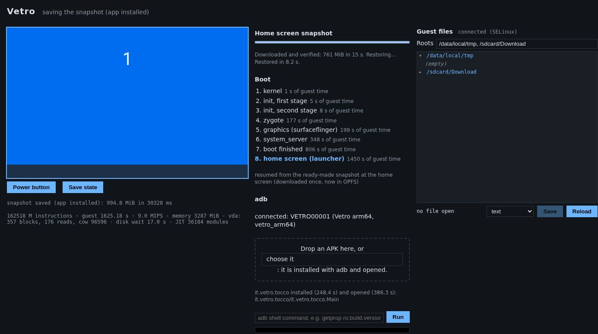
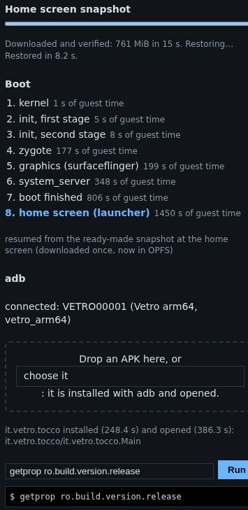

# Using the phone

The screen on the left of the page is the phone's touchscreen. **Click it
once** to give it the keyboard: a coloured outline shows that it has the
focus.

## Touch

The mouse plays the part of your finger.

| You do | The phone sees |
|---|---|
| Click | A tap |
| Press, hold, release | A long press |
| Press and drag | A swipe or a scroll |
| Drag from the top edge downwards | The notification shade |

For Back and Home, use the keys below (Esc and Alt+Esc), the navigation bar
when the system shows one, or the adb line.

Notes:

- The mouse wheel does not scroll: drag with the mouse instead, as you would
  with a finger.
- A mouse has one pointer, so two-finger gestures such as pinch to zoom are
  not possible yet.
- A touchscreen or a pen on your computer works too: each finger becomes a
  touch on the phone (up to ten).

## Keyboard

When the screen has the focus, the keys go to the phone as if a USB keyboard
were plugged in. The phone uses its own keyboard layout (US English by
default), so it reads the **position** of each key, not the character your
computer's layout prints on it.

Useful keys:

| Key | Effect |
|---|---|
| Esc | Back |
| Alt+Esc | Home |
| Arrows, Tab, Enter | Move between fields and buttons, confirm |
| Volume keys, if your keyboard has them | Volume |

Holding a key repeats it, as on a real keyboard. The page does not pass the
clipboard to the phone yet: to put text into a field, type it, or use the
adb line (`input text hello`).

When you click outside the screen, every key still held is released, so no
key stays stuck.

## The power button

**Power** under the screen is the phone's side button:

- a short press turns the screen off, and another one turns it back on;
- a long press (hold it for a second or two) opens the power menu.

Vetro keeps the screen on while the tab is open, so you normally do not need
it.

## Installing an app (APK)

Drag an `.apk` file from your computer and drop it **on the phone screen**
or on the dashed box in the Apps panel next to it. You can also click
**choose it** and pick the file.

Vetro then:

1. sends the APK to the phone and installs it (as `adb install` would);
2. opens the app's main screen;
3. saves the machine, so the app is still there at your next visit.

The line under the drop box shows each step, and how long it took. Installing needs the adb
connection, which is ready shortly after the home screen: if you drop an APK
earlier, it waits for it.

Things to know:

- The phone is **64-bit only** (arm64). Apps that ship only 32-bit native
  code (`armeabi-v7a`) cannot be installed.
- There is no Google Play and no Google Play Services; microG provides the
  basics that many apps expect. Apps that require Play Integrity will not
  work.
- Split APKs (App Bundles delivered as several files) are not supported by
  drag and drop yet: use a single, universal APK.



## The adb line

Under **Tools** (the small toggle below the screen) there is a command line
connected to the phone's adb shell. Type a command and press **Run** (or Enter): the output appears
below it, with the exit code when it is not zero. The shell runs as the
`shell` user; this is a development (userdebug) build, so `su 0 <command>`
runs a command as root.

Some examples:

```sh
getprop ro.build.version.release          # the system version
pm list packages -3                       # the apps you installed
am start -n com.example/.MainActivity     # open an activity
input keyevent KEYCODE_HOME               # press Home
input text hello                          # type text into the focused field
dumpsys window | grep mCurrentFocus       # which window has the focus
settings put system screen_brightness 200 # change a setting
```

The line runs `adb shell` commands only: there is no `adb push` or
`adb pull` here. To move files, use the [file manager](file-manager.md).



## The serial console

The black box under **Tools** is the system's serial console. It shows the
kernel and system log, and it is also a shell (as the `shell` user, like the
adb line): click it, type a command, then Enter. The adb line is usually more
convenient, because its output is not mixed with the log.
